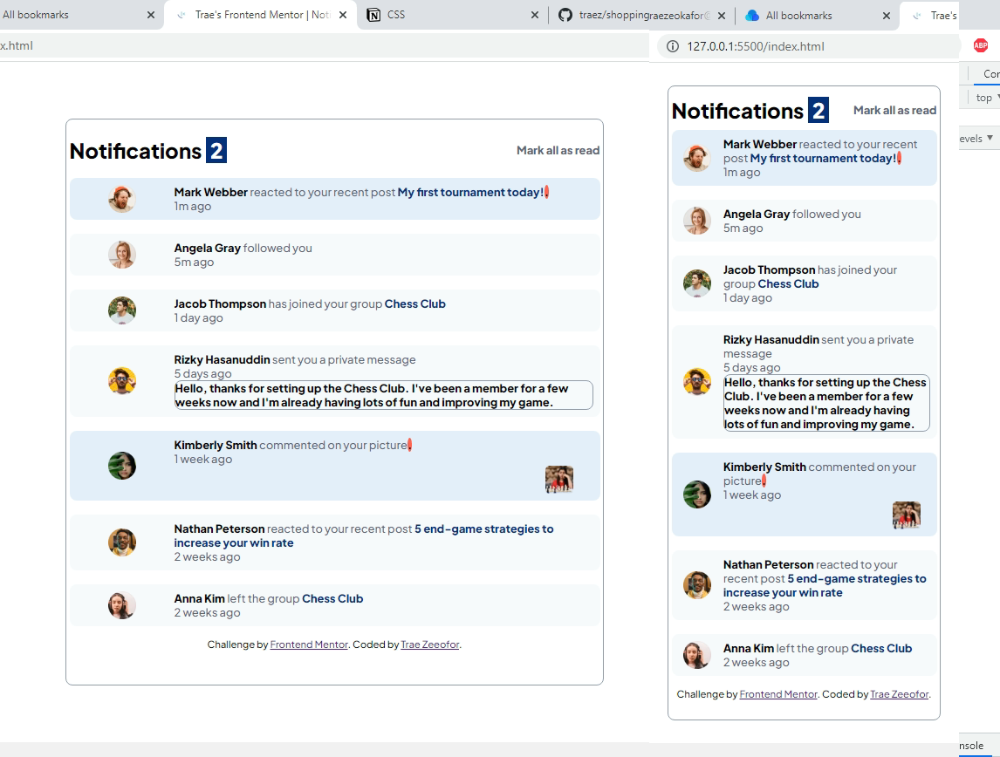

# Frontend Mentor - Notifications page solution

This is a solution to the [Notifications page challenge on Frontend Mentor](https://www.frontendmentor.io/challenges/notifications-page-DqK5QAmKbC). Frontend Mentor challenges help you improve your coding skills by building realistic projects. 

## Table of contents

- [Overview](#overview)
  - [The challenge](#the-challenge)
  - [Screenshot](#screenshot)
  - [Links](#links)
- [My process](#my-process)
  - [Built with](#built-with)
  - [What I learned](#what-i-learned)
  - [Continued development](#continued-development)
  - [Useful resources](#useful-resources)
- [Author](#author)
- [Acknowledgments](#acknowledgments)

## Overview

### The challenge

Users should be able to:

- Distinguish between "unread" and "read" notifications
- Select "Mark all as read" to toggle the visual state of the unread notifications and set the number of unread messages to zero
- View the optimal layout for the interface depending on their device's screen size
- See hover and focus states for all interactive elements on the page

### Screenshot

### Links

- Solution URL: [https://github.com/traez/notifications-page-main](https://github.com/traez/notifications-page-main)
- Live Site URL: [https://traez.github.io/notifications-page-main/](https://traez.github.io/notifications-page-main/)

## My process

### Built with

- Semantic HTML5 markup
- CSS custom properties
- Flexbox
- CSS Grid
- Mobile-first workflow

### What I learned

Took a break midway that was unnecessarily long. At times you'd want to jump CSS, but sticking it through helps further solidify learnings. The Javascript didn't stress. Reviewed previous code as guidance and surprisingly pieced this solution together rather quickly. Cool beans!

### Continued development

More clone replications, faster turn around time Isha Allah.  

### Useful resources

Stackoverflow, MDN Web Docs, w3schools, YouTube, Google  

## Author

- Website - [Trae Zeeofor](https://github.com/traez)  
- Frontend Mentor - [@traez](https://www.frontendmentor.io/profile/traez)  
- Twitter - [@trae_z](https://twitter.com/trae_z)

## Acknowledgments

All Youtube Code Content Creators. I see you and I still aspire...  
